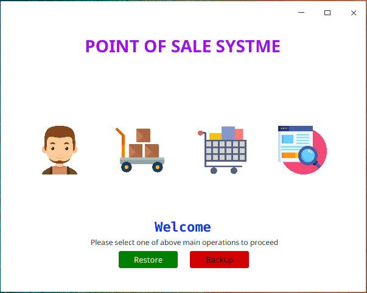
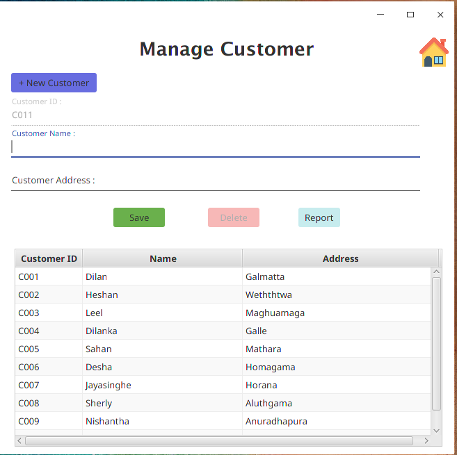
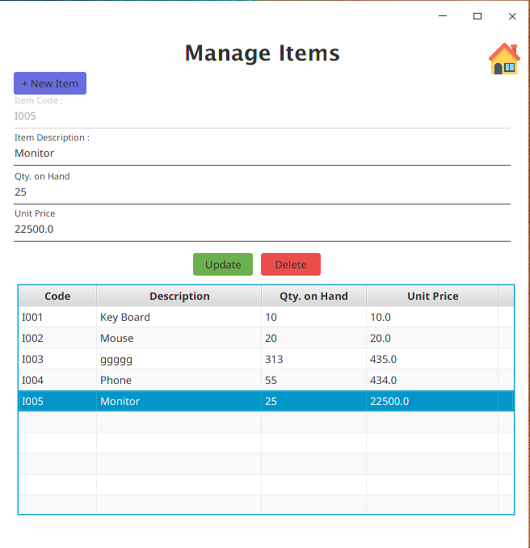
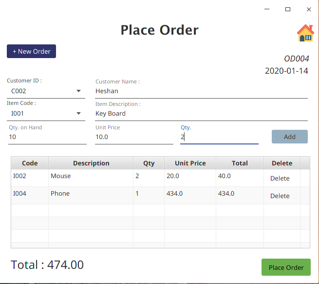
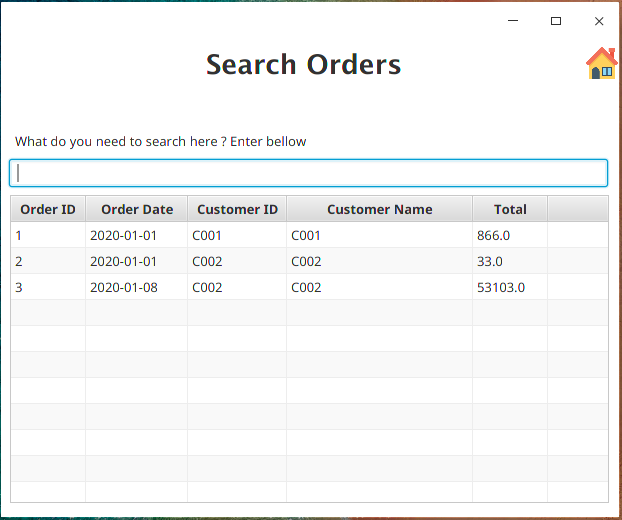

# Point of Sale System [Layered Architecture]

This Point of Sale System allows users to mange their daily sales process. 

## Features
This application mainly focus on the process of the Vendor. When using this application, vendor will have following features.
  * Adding Customer Details
  * Add Item Details
  * Place Orders
  * Update quantity after placing order
  * Search on Orders History
  * Database Backup/Restore 

  
## Built With
* Java SE 
* Hibernate
* Spring
* MySql
* Layered Architecture
* Japser Reports

## License
This Project is License under MIT License. Please referrer the  License file. 

## Screens 

Main Page:-

Manage Customers:-

Manage Items:-

Place Orders:-

Search Order:-
